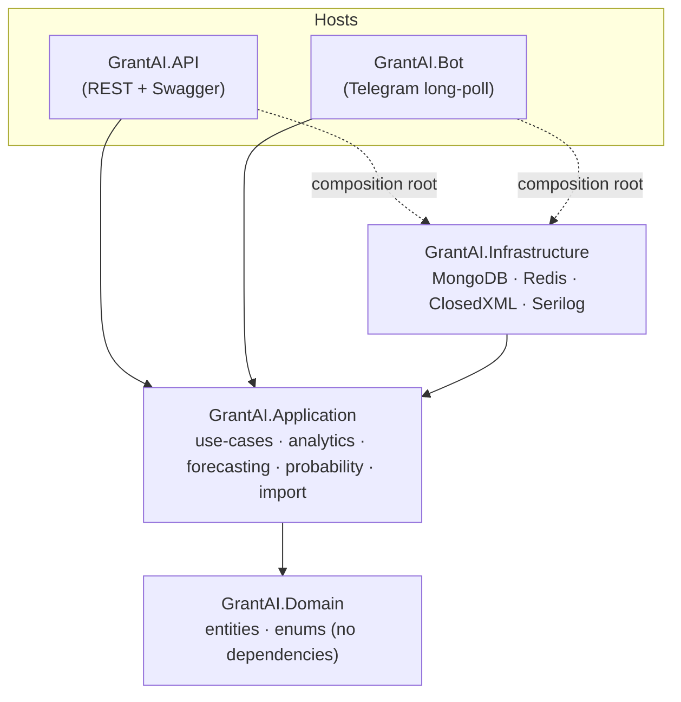
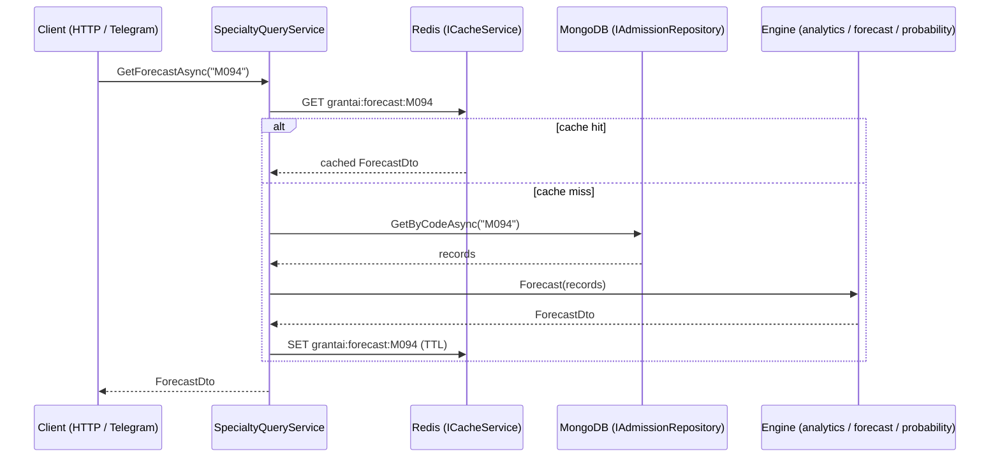
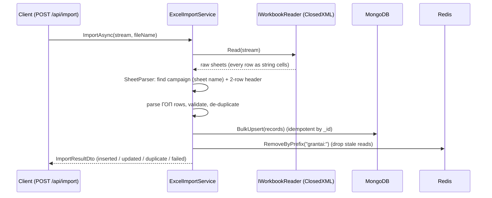

# Architecture

GrantAI KZ is a small Clean Architecture solution over Kazakhstan's master's
complex-testing (КТ) statistics — applications, participants and threshold
pass/fail counts per educational program group (ГОП). Dependencies point inwards
only: outer layers depend on inner ones, never the reverse. The domain has no
external dependencies at all, and the application layer depends only on the
domain plus a few cross-cutting abstractions.

## Layers

The two hosts reference Infrastructure **only** to register adapters in their
DI container at start-up (the composition root). All real work goes through
Application interfaces, so controllers and bot handlers never see MongoDB,
Redis or ClosedXML types.

## The dependency rule in practice

- **Domain** — `AdmissionRecord` (one ГОП per campaign: applications,
  participants, threshold pass/fail counts), `ImportLog`, and the `Season` /
  `TrendDirection` enums. Pure C# with no NuGet references. The Mongo `_id` is a
  deterministic natural key (`year|season|group`) built by
  `AdmissionRecord.BuildId(...)`, which makes re-imports idempotent.
- **Application** — the ports (`IAdmissionRepository`, `ICacheService`,
  `IWorkbookReader`) and the pure engines that implement the business logic.
  Forecasting, probability and analytics are all deterministic functions of the
  records passed in, which is what makes them easy to unit-test.
- **Infrastructure** — the adapters: `AdmissionRepository` (MongoDB.Driver),
  `RedisCacheService` (StackExchange.Redis), `ClosedXmlWorkbookReader`
  (ClosedXML) and the Serilog configurator. This is the only project that
  references those libraries.
- **API / Bot** — thin delivery mechanisms over the same `ISpecialtyQueryService`
  and `IExcelImportService`.

## Read path (cache-aside)

## Write path (import + cache invalidation)

Because every cache key is namespaced under `grantai:`, a successful import
invalidates all derived reads in one `SCAN`-based sweep, so the next query
recomputes from fresh data.

## Why these choices

- **MongoDB without an ORM.** The data is denormalised statistics; a document
  per campaign row fits naturally and the driver's `ReplaceOneModel` upsert gives
  idempotent imports for free via the natural-key `_id`.
- **Pure engines.** Keeping forecasting/probability/analytics free of I/O means
  the maths is unit-tested directly, with no mocks.
- **Single source of truth for the pass rate.** The probability engine consumes
  the forecast engine, so the predicted pass rate behind "chance" always matches
  the "forecast" endpoint.
