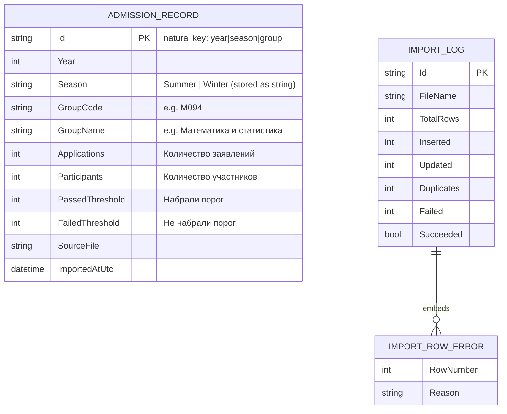

# Data model

Every published statistics workbook is normalised into one canonical document,
`AdmissionRecord` — one row per educational program group (ГОП) per campaign
(year + season). Import runs are tracked separately in `ImportLog`.

## Documents



`ImportRowError` is an embedded sub-document inside `ImportLog.Errors`, not a
separate collection.

## What the data is (and is not)

The source files come from the complex-testing (КТ) entrance exam. Per group and
campaign they report **counts**: how many applied, how many sat the test, and how
many cleared the entrance threshold ("порог") versus not. There is deliberately:

- **no per-applicant score**, no minimum/maximum/average score, and no single
  numeric "passing score" — the data is counts, not marks;
- **no grant allocation** — these are test-threshold results, not grant awards;
- **no admission-track split** (научно-педагогическое / профильное).

So the analytics are built around the **threshold pass rate** (% набравших порог),
which is what the data actually supports.

## Derived metrics

These are computed on read (in the analytics/mapping code), never stored:

- **Participation rate** = `Participants / Applications × 100` (test turn-out).
- **Pass rate** = `PassedThreshold / Participants × 100` (the headline metric).

Rates found in the source `%` columns are **ignored** and recomputed from the
integer counts, because those cells are inconsistent across files (sometimes a
float, sometimes a string like `"91.09"`, sometimes the literal `"%"`).

## Where year and season come from

They are **not** columns. Each sheet is named like `2024-зима-рус` and titled
"… в магистратуру 2024 г. (зима)"; the importer reads the campaign from the sheet
name, falling back to the title.

## The natural-key `_id`

Instead of a random `ObjectId`, each record's `_id` is a deterministic business
key produced by `AdmissionRecord.BuildId(...)`:

```
{Year}|{(int)Season}|{GROUPCODE}
```

The group code is trimmed and upper-cased. For example the 2025 summer row for
group `M094` becomes:

```
2025|1|M094
```

This makes imports **idempotent** (re-importing the same group/campaign updates
the same document via a `ReplaceOne` upsert) and makes **duplicates impossible**
by construction (two rows for the same group/campaign collapse to one key).

## Collections & indexes

| Collection           | Type             | Indexes                              |
|----------------------|------------------|--------------------------------------|
| `admission_records`  | `AdmissionRecord`| `_id` (key); `GroupCode`; `{ Year, Season }` |
| `import_logs`        | `ImportLog`      | `_id`                                |

Indexes are created on start-up by `MongoContext.EnsureIndexesAsync()`
(best-effort; the hosts log and continue if MongoDB is briefly unavailable).

## Enums (stored as strings)

| `Season` | value | | `TrendDirection` | value |
|----------|-------|-|------------------|-------|
| Summer   | 1     | | Falling          | -1    |
| Winter   | 2     | | Stable           | 0     |
|          |       | | Rising           | 1     |

> Campaign ordering for the time-series code is `year * 2 + (Winter ? 0 : 1)`, so
> the **winter** intake of a year sorts *before* that year's **summer** intake
> (January precedes August in Kazakhstan's admission calendar).
