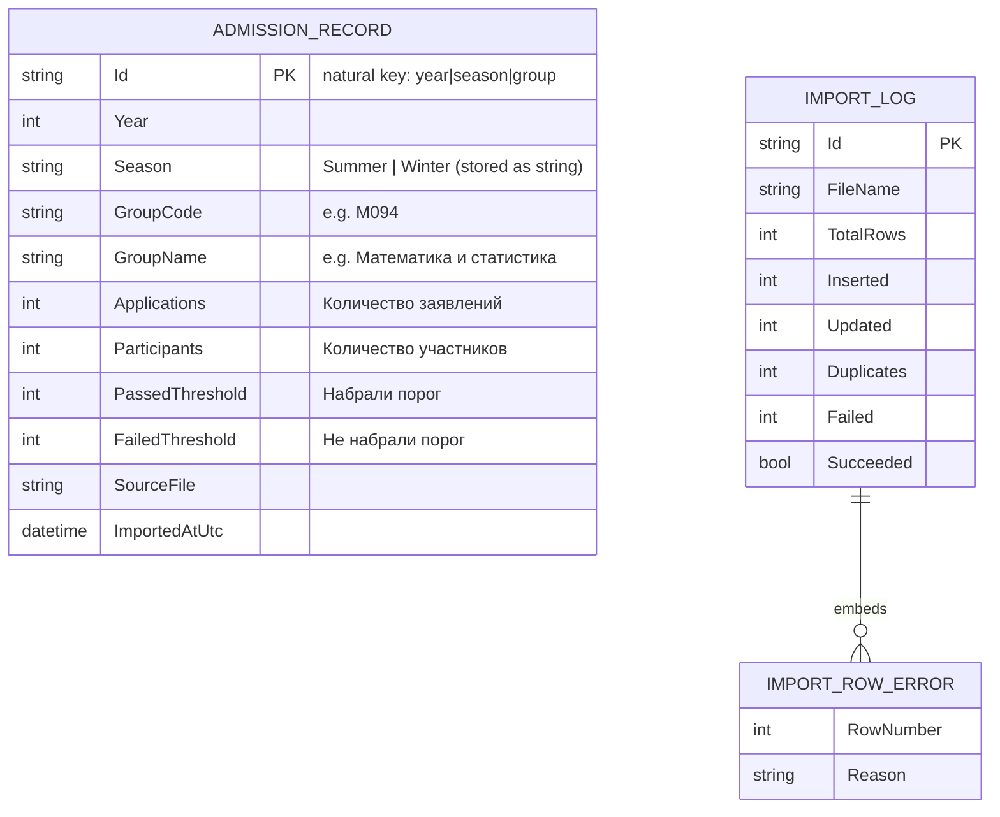
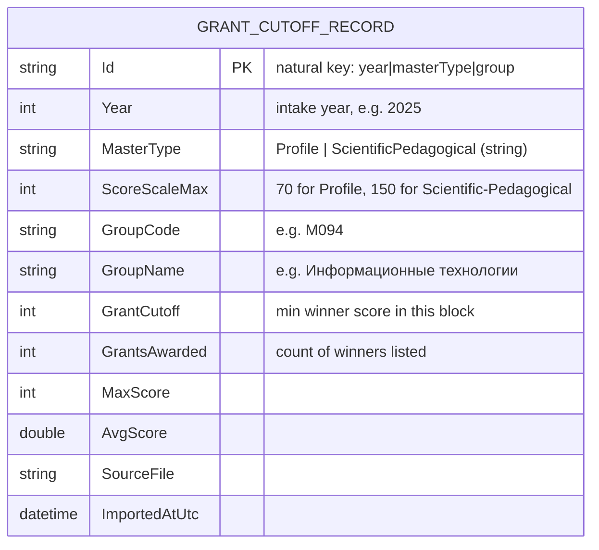

# Data model

The platform stores two independent streams of normalised documents:

- **`AdmissionRecord`** — entrance-test (КТ) threshold statistics, one row per
  ГОП per campaign (year + season), imported from Excel.
- **`GrantCutoffRecord`** — yearly grant-allocation statistics, one row per
  ГОП per intake year per master's track, imported from the published PDFs.

Import runs are tracked separately in `ImportLog`.

## Documents



`ImportRowError` is an embedded sub-document inside `ImportLog.Errors`, not a
separate collection.

The grant-side document looks like this:



## What the threshold (Excel) data is — and is not

The source files come from the complex-testing (КТ) entrance exam. Per group and
campaign they report **counts**: how many applied, how many sat the test, and how
many cleared the entrance threshold ("порог") versus not. They contain:

- **no per-applicant score**, no minimum/maximum/average score, and no single
  numeric "passing score" — the data is counts, not marks;
- **no master's-track split** — both Profile and Scientific-Pedagogical are
  pooled into one row per (group, campaign).

So the threshold analytics are built around the **threshold pass rate** (%
набравших порог), which is what the threshold data actually supports.

## What the grant (PDF) data is — and is not

The grant PDFs list every grant winner per ГОП, sorted by descending score.
Per row they carry: row number, 8-digit ИКТ, ФИО, **Сумма баллов** (the
applicant's score), and — sometimes — a 3-digit ОВПО (host university) code.

Sections split by master's track (`ПРОФИЛЬНАЯ` / `НАУЧНО-ПЕДАГОГИЧЕСКАЯ`), and
the two tracks use **different score scales** (70 vs 150), so cutoffs from one
track are **not comparable** to cutoffs from the other. The track is stored
alongside every record so the API can always report the right scale.

The headline metric is the **grant cutoff**: the minimum winner score in a
block — i.e. the lowest score that still claimed a grant.

## Derived metrics

These are computed on read (in the analytics/mapping code), never stored:

- **Participation rate** = `Participants / Applications × 100` (test turn-out).
- **Pass rate** = `PassedThreshold / Participants × 100` (the headline metric).

Rates found in the source `%` columns are **ignored** and recomputed from the
integer counts, because those cells are inconsistent across files (sometimes a
float, sometimes a string like `"91.09"`, sometimes the literal `"%"`).

## Where year and season come from

They are **not** columns. Each sheet is named like `2024-зима-рус` and titled
"… в магистратуру 2024 г. (зима)"; the importer reads the campaign from the sheet
name, falling back to the title.

## The natural-key `_id`

Instead of a random `ObjectId`, each record's `_id` is a deterministic business
key produced by `AdmissionRecord.BuildId(...)`:

```
{Year}|{(int)Season}|{GROUPCODE}
```

The group code is trimmed and upper-cased. For example the 2025 summer row for
group `M094` becomes:

```
2025|1|M094
```

This makes imports **idempotent** (re-importing the same group/campaign updates
the same document via a `ReplaceOne` upsert) and makes **duplicates impossible**
by construction (two rows for the same group/campaign collapse to one key).

## Collections & indexes

| Collection           | Type               | Indexes                                       |
|----------------------|--------------------|-----------------------------------------------|
| `admission_records`  | `AdmissionRecord`  | `_id` (key); `GroupCode`; `{ Year, Season }`  |
| `import_logs`        | `ImportLog`        | `_id`                                         |
| `grant_cutoffs`      | `GrantCutoffRecord`| `_id` (key); `GroupCode`; `{ Year, GroupCode }` |

Indexes are created on start-up by `MongoContext.EnsureIndexesAsync()`
(best-effort; the hosts log and continue if MongoDB is briefly unavailable).

## Enums (stored as strings)

| `Season` | value | | `TrendDirection` | value | | `MasterType`           | value |
|----------|-------|-|------------------|-------|-|------------------------|-------|
| Summer   | 1     | | Falling          | -1    | | Profile                | 1     |
| Winter   | 2     | | Stable           | 0     | | ScientificPedagogical  | 2     |
|          |       | | Rising           | 1     | |                        |       |

> Campaign ordering for the time-series code is `year * 2 + (Winter ? 0 : 1)`, so
> the **winter** intake of a year sorts *before* that year's **summer** intake
> (January precedes August in Kazakhstan's admission calendar).
